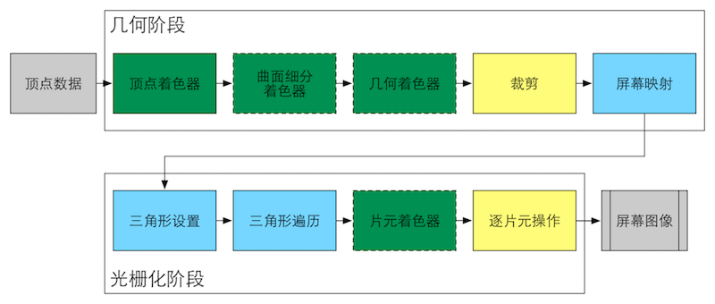

## ***渲染流水线***
---------------------------------------------------------------------------
#### **LearnOpenGL-CN**
最早对pipeline的认识来自于learn-opengl网址上的介绍. 如下图所示. 

- 将物体的顶点作为输入, 从一个3D坐标转为另一个3D坐标. 这也就是顶点着色器的作用. 
- 下一步则是进行图元装配(primitive assembly). 图元是什么? 这个问题困扰过我很久, 而后在查阅了各类资料并与该网址对比后得知, 图片就是渲染的基础单位, 点、线、三角形、正方形...
    > 为了让OpenGL知道我们的坐标和颜色值构成的到底是什么，OpenGL需要你去指定这些数据所表示的渲染类型。我们是希望把这些数据渲染成一系列的点？一系列的三角形？还是仅仅是一个长长的线？做出的这些提示叫做图元(Primitive)
- 我从没有了解过几何着色器, 写这篇笔记时我查阅了一些资料, 有一张图是我认为可以帮助理解, 如下所示. 几何着色器作为vertex shader与pixel shader的中间层存在着. 在dx10中第一次出现几何着色器的使用, 它主要的功能是以部分顶点信息来批量处理几何图形, 对vertex旁边的数据快速处理, 创造出新的多边形.

    在learnopengl了解到, 几何着色器将输入的几个顶点, 绘制成一个以上简单的图元, 通常是以三角形的形式来存在的. 最常见的还是使用在爆炸效果中, 可以知道常见的爆炸并不是破坏物体的面片, 而是让其沿法线方向进行一定的运动. 无论物体有多复杂, 我们都可以通过三角形的3个顶点来实现, 两条线段进行叉乘即可获得法线, 从而完成爆炸计算.

    
- 下一个阶段则是被称为光栅化阶段. 将primitive映射成屏幕上的像素点, 之后会对图形进行裁切, 剪除视野内看不到的像素点, 提高效率减少fragment shader浪费计算. 之后通过fragment shader完成上色方面的计算, 最后经过test与blend形成最后的颜色.
---------------------------------------------------------------------------
#### **Unity Shader 入门精要**
本书上对渲染管线的理解来源于real-time rendering这本渲染天书中. 书中对渲染管线分成了三个阶段, 应用阶段、几何阶段与光栅化阶段.

- 应用阶段属于纯开发者控制的阶段, 即我们在unity中搭建物体, 撰写脚本. 同时在这个阶段我们可以完成occulusion culling以及lightmap方面的优化, 提高渲染的性能. 然后将顶点颜色信息输入给几何阶段则是该阶段要做的最重要的事情.
- 几何阶段则是将每一个渲染用的primitives从model space转换到屏幕空间中, 再交付给光栅化阶段.
- 光栅化阶段与前面learn-opengl中的差别不大, 不展开描述了.

#### **GPU流水线**

> 颜色表示了不同阶段的可配置性或可编程性：绿色表示该流水线阶段是完全可编程控制的，黄色表示该流水线阶段可以配置但不是可编程的，蓝色表示该流水线阶段是由GPU固定实现的，开发者没有任何控制权。实线表示该shader必须由开发者编程实现，虚线表示该Shader是可选的
- 顶点着色器: 空间变换. 由model space => NDC space.
- 曲面细分着色器: 由GPU来进行平面的细分, 生成曲面, 而细分的规则由开发者指定.
- 几何着色器: 批量处理几何图形.
- 裁剪: 剔除不在摄像机frustrator中的面片.
- 屏幕映射: 将图元的坐标转到屏幕坐标系中.
- 三角形设置: 光栅化的初始阶段. 这个阶段计算光栅化一个三角网格所需要的信息. 将上一阶段获得的顶点坐标进行计算, 获得每一条边的像素坐标.
- 三角形遍历: 检查每一个像素点是否被某个三角网格覆盖, 如果被覆盖则生成一个片元.
- 片元着色器: 逐片元的着色方式.
- 逐片元操作: 修改颜色、深度缓冲、混合等操作.

#### **CPU与GPU的通信方式**
pipeline的起点是cpu, 以下则是cpu行为的三个阶段:
1. 把数据加载到显存当中. 将渲染所需要的数据从硬盘加载到系统内存(Random Access Memory)中. 之后再讲grid和texture等等(例如normal, tangent)加载至显存当中, 这是因为显卡在VRAM(Video Random Access Memory)有着更高的读写速度, 而且大多数显卡不具有访问RAM的权限.
2. 设置渲染的状态. 让CPU来指定需要的纹理、材质以及着色器, 这就是设置渲染状态的过程, 准备好以上的状态后, CPU会发起一个Draw Call给GPU.
3. 调用Draw Call. 一个Draw Call仅仅会指向一个primitives.
