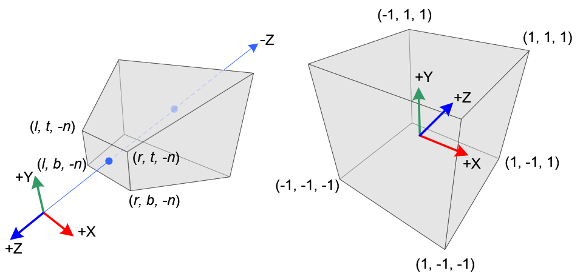
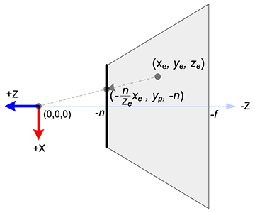
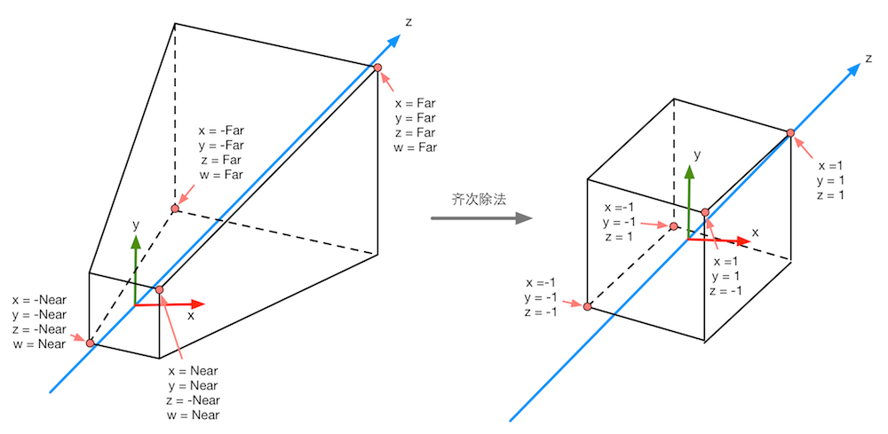

## **坐标系**
---------------------------------------------------------------------------
#### **坐标空间转换流程**
1. 模型空间(model space):
   - 使用**左手坐标系**.
   - 又被称为**对象空间**(object space)或**局部空间**(local space).
   - 当物体发生平移旋转时, 它的坐标系也会发生平移和旋转.
2. 世界空间(world space):
   - 使用**左手坐标系**.
   - 转换流程的第一步就是从**模型空间**转换到**世界空间**, 通过Chap4_Math中的转换矩阵即可实现这个转换.
3. 观察空间(view space):
   - 使用**右手坐标系**. 与其他的坐标系z轴相反, 摄像机的正前方则是-z的方向.
   - 又被称为**摄像机空间**(camera space). 它是模型空间的一个特例, 这个模型则是摄像机.
   - 从**世界空间**转换到**观察空间**同样使用上述的矩阵. 但要注意最后对z方向进行取反, 因为两者使用的坐标系方向不同.
4. 裁剪空间(clip space):
   - 使用**左手坐标系**.
   - 使用**裁剪矩阵**(又被称为**投影矩阵**(projection matrix))进行变换. 常用的两个矩阵为正交投影和透视投影. 透视投影有着近大远小的视觉效果, 正交投影则会完全一致适合2D游戏以及UI界面.
   - 投影矩阵并不会进行真正的投影计算, 即不会在这个时候把3d视图变为2d的, 但是会将视椎体内的变换成齐次坐标系(4D空间), 也就是裁剪空间.
   
   

   - 投影矩阵推导如下:
     $$
        \left[
            \begin{matrix}
                x_{clip}\\
                y_{clip}\\
                z_{clip}\\
                w_{clip}\\
            \end{matrix}
        \right]
        =
        M_{projection} *
        \left[
            \begin{matrix}
                x_{eye}\\
                y_{eye}\\
                z_{eye}\\
                w_{eye}\\
            \end{matrix}
        \right]
     $$
     $$
        \left[
            \begin{matrix}
                x_{ndc}\\
                y_{ndc}\\
                z_{ndc}\\
            \end{matrix}
        \right]
        =
        \left[
            \begin{matrix}
                x_{clip}/w_{clip}\\
                y_{clip}/w_{clip}\\
                z_{clip}/w_{clip}\\
            \end{matrix}
        \right]
     $$
     - 在空间中有一点, 坐标为$(x_e, y_e, z_e)$. 与近平面相交于一点, 坐标为$(x_p, y_p, z_p)$.
     - $\cfrac{-n}{z_e} = \cfrac{x_p}{x_e}$与$\cfrac{-n}{z_e} = \cfrac{y_p}{y_e}$.
     - 关于y轴同理可得, 从而推出交点坐标$(\cfrac{-n}{z_e}x_e, \cfrac{-n}{z_e}y_e, -n)$. 在xy的平面上只要分别除以l和r就能获得(-1,1)的区间, 为了让z轴也处于(-1,1)的区间, 所以使用$-z_e$来作w值. $z_{ndc} = (k*z_e+b)/-z_e$, $z_{ndc}$在-1,1的位置则可产生两条公式:
       - $-1 = -k + b/n$
       - $1 = -k + b/f$
       - $b = \cfrac{2fn}{n-f}, k = \cfrac{n+f}{n-f}$
       - $z_{clip} = \cfrac{n+f}{n-f}z_e + \cfrac{2fn}{n-f}$
     - 关于xy平面的计算:
       - $x_{ndc} = \cfrac{1--1}{r-l}x_p+b$.
       - $1 = \cfrac{2r}{r-l} + b$ => $b = \cfrac{l+r}{l-r}$
       - $x_{ndc} = \cfrac{2}{r-l}*\cfrac{nx_e}{-z_e} + \cfrac{l+r}{l-r}$
       - $x_{clip} = \cfrac{2nx_e}{r-l} + \cfrac{(r+l)z_e}{r-l}$
       - $y_{clip} = \cfrac{2ny_e}{t-b} + \cfrac{(t+b)z_e}{t-b}$
     - 推出矩阵如下:
     $$
        \left[
            \begin{matrix}
                \cfrac{2n}{r-l}&0&\cfrac{r+l}{r-l}&0\\
                0&\cfrac{2n}{t-b}&\cfrac{t+b}{t-b}&0\\
                0&0&\cfrac{n+f}{n-f}&\cfrac{2fn}{n-f}\\
                0&0&-1&0\\
            \end{matrix}
        \right]
     $$
    
    - 正交投影矩阵:
      - $x_{ndc} = \cfrac{2}{r-l}x_e + \beta$, 代入$x_{ndc}$为-1, $x_e$为l.
      - $\beta = -\cfrac{r+l}{r-l}$
      - 同理可得, $y_{ndc} = \cfrac{2}{t-b}y_e - \cfrac{t+b}{t-b}$
      - $z_{ndc}=\cfrac{2}{-f+n}z_e+\beta$, 代入$z_{ndc}$为-1, $z_e$为-n. $\beta=-1+\cfrac{2n}{n-f}$
      - $z_{ndc}=-\cfrac{2}{f-n}z_e-\cfrac{f+n}{f-n}$
      - 推出矩阵如下:
      $$
         \left[
             \begin{matrix}
                \cfrac{2}{r-l}&0&0&-\cfrac{r+l}{r-l}\\
                0&\cfrac{2}{t-b}&0&-\cfrac{t+b}{t-b}\\
                0&0&-\cfrac{2}{f-n}&-\cfrac{f+n}{f-n}\\
                0&0&0&1\\
             \end{matrix}
         \right]
      $$

5. 屏幕空间(screen space):
   - 由于上述的齐次坐标的w值为$-z_e$, 且$x_{clip}/w_{clip}\in{[-1,1]}$, 所以可以得知clip空间的形状和大小应该如下图所示:
   
   - 获得Normalized Device Coordination后, 将这个正方体的面映射到屏幕上, 这个映射较为简单, 只是一个缩放的过程.
---------------------------------------------------------------------------
#### **Unity Shader**
- 矩阵: 
  - 在Unity Shader中的矩阵采用右乘的方式. 有时候也可以使用左乘来减少转置矩阵的计算.
  - 在Shaderlab中构建矩阵, 采用的是行优先的顺序, 即先填充每一行的参数, 之后再填充下一行. 而在unity的脚本中也有一个Matrix类, 这时采用的则是列优先的顺序.
- 法线变换: 法线在空间变换时, 直接使用空间变换矩阵会得到错误的结果. 此时则需要更换一个矩阵G来作为法线变换的转换矩阵.
  - $T_A\cdot N_A = 0, T_B\cdot N_B = 0$
  - $T_B = M_{A\to{B}}T_A, M_{A\to{B}}T_A \cdot GN_A = 0$
  - $T_B \cdot N_B = (T_B)^T N_B = 0$
  - $(M_{A\to{B}}T_A)^T GN_A = T_A^T M_{A\to{B}}^T G N_A = 0$
  - 当$M_{A\to{B}}^T G = I$时, 上述式子成立. 则$G = (M_{A\to{B}}^T)^{-1}$
  - 在shaderlab中使用UNITY_MATRIX_IT_MV来表示这个矩阵(从model空间到view空间).