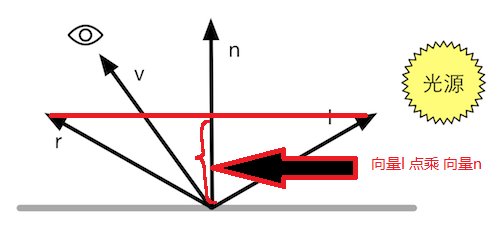
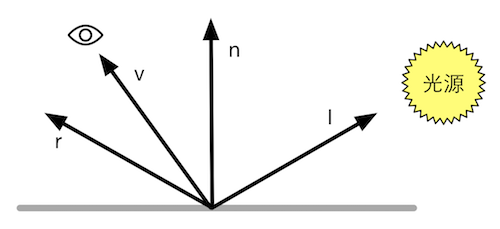
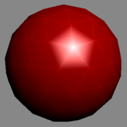

## **基础光照**
---------------------------------------------------------------------------
#### **吸收与散射**
- 光线和物体相交后会有两种情况, 散射(scattering)和吸收(absorption).
  - 散射: 只改变光线的方向, 不会改变光线的颜色和密度. 散射到物体内部的情况称作折射(refraction), 散射到外部的情况则被称为反射(reflection).
  - 我们使用漫反射(diffuse)来表示折射的现象, 光在折射进入物体后还会被吸收和散射出去, 同样也使用漫反射来表示.
  - 使用高光反射(specular)来表示那些被反射出去的光线.
    
---------------------------------------------------------------------------
#### **标准光照模型**
- 标准光照模型由四个部分组成:
  - 自发光(emissive)
  - 环境光(ambient)
  - 漫反射(diffuse)
    - 漫反射颜色 = 光的颜色 * 物体材质颜色 * 法线与入射光线夹角的余弦值. 当垂直时余弦值最小, 光最弱为0. 当平行时, 余弦值最大, 从而此时的漫反射光为最大值.
    - $c_{diffuse}=(c_{light} \cdot m_{diffuse})\max(0,\vec{n} \cdot \vec{l})$
    - 漫反射模型即兰伯特模型, 符合兰伯特定律, 在平面某一点的diffuse强度与法线入射光余弦值乘正比
      - 半兰伯特模型, $c_{diffuse}=(c_{light} \cdot m_{diffuse})(\alpha(\vec{n} \cdot \vec{l})+\beta)$
      - 通常半兰伯特模型使用0.5和0.5两个参数填充, 保证等式的后半部分的范围是[0,1], 这让背光的一面也会有明暗的变化.
  - 高光反射(specular)
    - 高光反射颜色 = 光的颜色 * 物体高光颜色 * 视角方向与反射角的余弦值的gloss次方.
    - $\vec{r} = 2(\vec{n} \cdot \vec{l})\vec{n}-\vec{l}$, 通过法线和入射光线的方向计算出反射光线.
    
    - Phong模型的公式: $c_{specular}=(c_{light} \cdot m_{specular})\max(0,\vec{v} \cdot \vec{r})^{m_{gloss}}$
    
    - Blinn的公式, 引入了一个新的变量$\vec{h}=\cfrac{\vec{v}+\vec{l}}{|\vec{v}+\vec{l}|}$. 当摄像机和光源离物体都比较远的时候$\vec{v}$和$\vec{l}$无限接近一个定值, 此时计算Blinn模型时的性能开销会低于Phong模型.
    - $c_{specular}=(c_{light} \cdot m_{specular})\max(0,\vec{h} \cdot \vec{n})^{m_{gloss}}$
    - 该模型有着很多的局限性, 如其无法正确的表现菲涅尔反射的效果. 以及一些物体具有各向异性的特点(拉丝金属和头发), 一块电阻的两个方向阻值不同就可以称为各向异性, 这个特点在Blinn-Phong模型中很难有表现, 这个模型时属于各向同性的模型. 各向异性的模型需要使用基于物理的模型(PBR)来计算.

- 渲染方式
  - 逐像素渲染
    - Phong Shading: 以每一个像素点为基础, 获得其法线(从插值获取或者从法线贴图中获取), 再进行光照模型的计算.
  - 逐顶点渲染
    - Gouraud Shading: 以顶点为基础来计算光照, 然后再通过线性插值计算非顶点处的像素颜色, 这样的做法相比Phong Shading计算量远远的缩小. 但由于使用的时线性插值的方式来计算, 所以当光照模型出现非线性的值时, 其像素表现就会出现误差. 如下图高光区域就会有一个明显的表面.

    