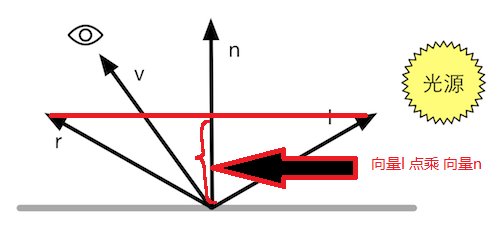

## **基础光照**
---------------------------------------------------------------------------
#### **吸收与散射**
- 光线和物体相交后会有两种情况, 散射(scattering)和吸收(absorption).
  - 散射: 只改变光线的方向, 不会改变光线的颜色和密度. 散射到物体内部的情况称作折射(refraction), 散射到外部的情况则被称为反射(reflection).
  - 我们使用漫反射(diffuse)来表示折射的现象, 光在折射进入物体后还会被吸收和散射出去, 同样也使用漫反射来表示.
  - 使用镜面反射(specular)来表示那些被反射出去的光线.
    
---------------------------------------------------------------------------
#### **标准光照模型**
- 标准光照模型由四个部分组成:
  - 自发光(emissive)
  - 环境光(ambient)
  - 漫反射(diffuse)
    - 漫反射颜色 = 光的颜色 * 物体材质颜色 * 法线与入射光线夹角的余弦值. 当垂直时余弦值最小, 光最弱为0. 当平行时, 余弦值最大, 从而此时的漫反射光为最大值.
    - $c_{diffuse}=(c_{light} \cdot m_{diffuse})\max(0,\vec{n} \cdot \vec{l})$
  - 镜面反射(specular)
    - 镜面反射颜色 = 光的颜色 * 物体镜面颜色 * 视角方向与反射角的余弦值的gloss次方.
    - $\vec{r} = 2(\vec{n} \cdot \vec{l})\vec{n}-\vec{l}$, 通过法线和入射光线的方向计算出反射光线.
    
    - $c_{specular}=(c_{light} \cdot m_{specular})\max(0,\vec{v} \cdot \vec{r})^{m_{gloss}}$
