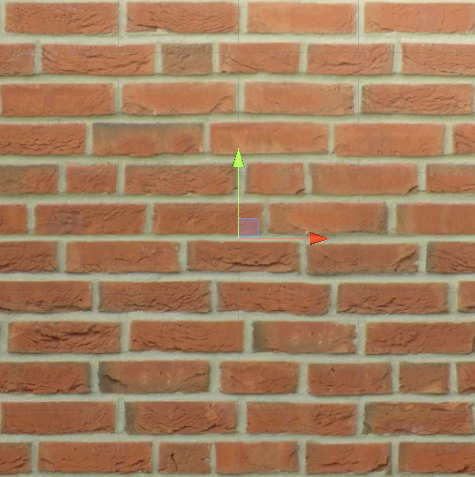

## **基础纹理**
---------------------------------------------------------------------------
#### **UV坐标**
- UV是一组纹理映射坐标, 横轴为U, 纵轴为V. 范围都是[0,1], 不管纹理的大小是256x256还是1024x1024.
  - 在OpenGL和DirectX中UV坐标的原点是不同的, 在OpenGL中的原点处于左下角, 而DirectX则处于左上角. Unity会为我们处理这一差异. 在Unity中, 纹理坐标的原点和OpenGL保持一致.
---------------------------------------------------------------------------
#### **纹理属性**

- Texel, Texture Pixel, 纹理像素. 一张图片由很多个像素点组成, 而这每一个像素点都被称为纹素.
- 以上两图分别使用了不同的平铺属性, 上图使用1,1下图则是2,2. 差别在于二者的UV值, 下方的UV是要经过2倍放大的, 所以在平面一半的位置其UV就已经达到1.0f, 所以在后续的位置的采样处于[1,2]的范围. 这张纹理选择的是Clamp采样方式, 所有大于1的部分都会变成1, 得到一个拉伸的效果.
- 多级渐远纹理: mip map. unity在运行时加载了多个低一档采样的贴图在内存中, 当物体离摄像机较远时可以使用低采样的贴图以节省计算时间.

  
- 滤波器.
  - Point: 邻近过滤, 会采用离纹理坐标(Texture Coordinate)最近的那个像素点的采样值. (UV即纹理坐标).
  
  
  - Bilinear: 找到四个邻近像素, 进行线性插值混合得出结果.
  
  
  - Trilinear: 和Bilinear类似, 但是会在两个邻近的mipmap之间进行插值计算. 如果不使用mipmap, 则与Bilinear没有区别.
---------------------------------------------------------------------------
#### **凹凸映射**
- 凹凸映射分为高度映射和法线映射两种:
  - 高度映射: 颜色越浅表示越凸起, 颜色越深表示越往里凹陷.
  - 法线映射: 将范围为(-1, 1)的法线用(0, 1)的颜色来存储, 这需要一个转换公式, pixel = normal/2 + 0.5.
    - 切线空间: z轴为法线, x轴为切线, y轴则是副切线. 使用切线空间的法线有几个好处:
      - 这个空间下的法线存储的是相对的法线信息, 即可以在不同的模型上使用这个法线贴图并获得一个相对正确的结果.
      - 由上述的原因就运行这个模型制作UV动画, 而不至于造成法线信息完全错乱的结果. 使用模型空间的法线会出现不可意料的结果. 可以观察二者的法线贴图得出结论.
      
      
      - 可压缩性, 切线空间的法线总是正向的, 可以通过xy直接推导出z轴(法线)方向.
