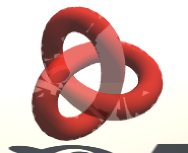

## **透明效果**
---------------------------------------------------------------------------
#### **渲染顺序**
- 透明混合的时候, 透明物体需要关闭深度写入. 这是由于当有物体处于透明物体之后时, 不关闭深度写入会被后面的物体剔除, 无法通过深度测试.
- 但由因为关闭了深度写入, 先写入透明物体, 再写入不透明物体(在后方), 二者不会混合, 不透明物体会直接覆盖透明物体. 所以需要控制渲染顺序, 让所有不透明物体先进行渲染, 再去渲染透明物体.
- 在透明物体之间我们再通过其render queue来决定他们的渲染顺序, 值越高越晚渲染.
    |名称|render queue|描述|
    |:----|:----|:----|
    |Background:      |1000|    背景物体, 最早渲染.
    |Geometry:        |2000|    大多数不透明物体使用这个队列.
    |AlphaTest:       |2450|    在所有不透明物体渲染完后再渲染透明度测试的物体(更高效).
    |Transparent:     |3000|    在前面两种物体渲染完成后才开始渲染.
    |Overlay:         |4000|    最后渲染, 实现叠加效果.  
- 在相同的render queue的情况下, 离相机越远的物体会更早进行渲染.
- 书上的alpha blend使用了两个pass来渲染knot物体, 第一个pass进行深度写入但不写入颜色, 第二个pass进行颜色的计算, 这样可以得到一个内部不会进行混合的物体. 
  - 注意: 若是把深度写入的pass和颜色计算的pass合并, 会得到一个预期外的物体, 因为unity没办法控制一个模型内部的渲染顺序, 尤其没有深度写入时会造成错乱.
  